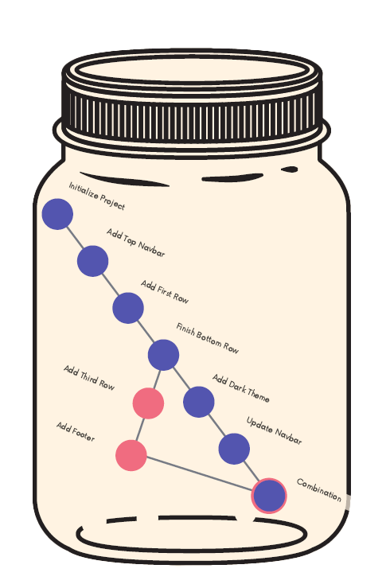

# The Very Basics Of Git



<figure><figcaption></figcaption></figure>

<table data-header-hidden data-full-width="true"><thead><tr><th></th><th></th></tr></thead><tbody><tr><td>A Git "Repo" is a workspace which tracks and manages files within a folder. Anytime we want to use Git with a project, app, etc we need to create a new git repository. We can have as many repos on our machine as needed, all with separate histories and contents</td><td></td></tr></tbody></table>
