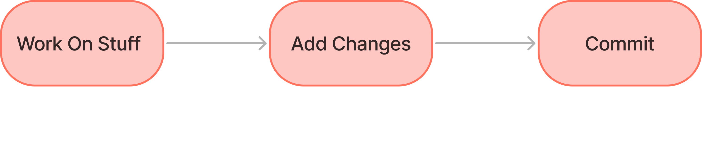
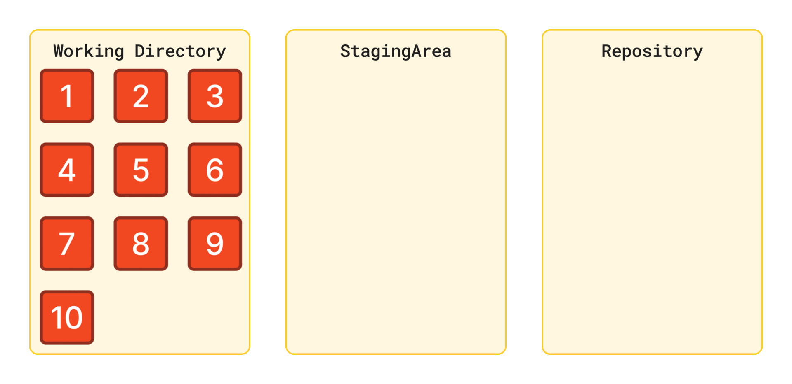

# The Very Basics Of Git


## Repository

<div data-full-width="false"><figure><figcaption></figcaption></figure></div>

## Initialize Repository

```bash
git init
```

**Use git init to create a new git repository.**&#x20;

Before we can do anything git-related, we must initialize a repo first! This is something you do once per project. Initialize the repo in the top-level folder containing your project.



Now that the Repository has been initialized we can check the status

```bash
git status
```

git status gives information on the current status of a git repository and its contents




DO NOT INIT A REPO INSIDE OF A REPO!&#x20;

Before running git init, use git status to verify that you are not currently inside of a repo.


If you do end up making a repo inside of a repo, you can delete it and try again! To delete a repo, locate the associated .git directory and delete it.

### Git Is Now Watching Us!

If we try making a new file in our repo, and then run git status again, we will see that git noticed the file, but it is "untracked".


## Committing

Making a commit is similar to making a save in a video game. We're taking a snapshot of a git repository in time.&#x20;

When saving a file, we are saving the state of a single file. With Git, we can save the state of multiple files and folders together.

### The Basic Git Workflow

<div data-full-width="false"><figure><figcaption></figcaption></figure></div>

We use the git add command to stage changes to be committed. It's a way of telling Git, "please include this change in our next commit".

```bash
git add file1 file2
```

Use git add to add specific files to the staging area. Separate files with spaces to add multiple at once.

```bash
git add .
```

Use git add to add specific files to the staging area. Separate files with spaces to add multiple at once.


**Git Status Is Your Friend**&#x20;

Use git status constantly to verify what changes are staged and not staged!


With this middle state we can group group changes before committing.

For example: In a Project I created 10 new files. but the last 5 are for another reason than the first 5.

We can add the 5 files to the staging area commit them and then the rest.

<figure><figcaption></figcaption></figure>

We use the git commit command to actually commit changes from the staging area. When making a commit, we need to provide a commit message that summarizes the changes and work snapshotted in the commit.

```bash
git commit -m "my message"
```

The -m flag allows us to pass in an inline commit message, rather than launching a text editor.


commit will always commit everything in Staging Area.


```git
git commit -a -m "my message"
```

Giving the flag -a to commit it will stage and commit all changes

***

When we edit an already committed file and we call "git status", we will see the file marked as modified.

To see the commit history, we can call the "log" command.

```bash
git log
```

This will print a list of all the commits. This list contains:

1. **The Commit Hash**: A unique SHA-1 identifier for the commit.
2. **The Author**: The person who made the commit.
3. **The Date**: When the commit was made.
4. **The Commit Message**: A description of the changes introduced in the commit.



## Wrap Up

Here is an exercise to practice everything this page contains.


